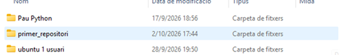
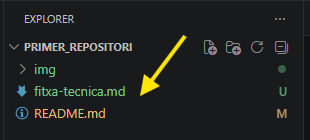

# Fitxa tècnica: Documentar i versionar: Markdown i Git local

## Taula de continguts
- Objectiu
- Materials
- Procediment
- Comprovacions
- Incidències-i-solucions
- Recursos

## Objectiu
Aprendre a redactar documentació tècnica estructurada utilitzant el llenguatge de marcatge Markdown i gestionar el seu historial de versions de forma local amb Git abans de pujar-ho a GitHub.

## Materials
- Editor de codi Visual Studio Code instal·lat.
- Sistema de control de versions Git configurat.
- Compte personal a la plataforma GitHub.
## Procediment
1. **Pas 1:** Obrir el Visual Studio Code i accedir a la carpeta del projecte `PRIMER_REPOSITORI`.  <br>                                                       
 <br>

2. **Pas 2:** Crear un nou fitxer buit anomenat exactament `fitxa-tecnica.md`. <br>

 <br>

3. **Pas 3**: Redactar el contingut seguint l'estructura oficial i la sintaxi de Markdown. <br>
```markdown 
# Fitxa tècnica: [títol]

## Objectiu

## Materials

## Procediment

1. Pas inicial.
2. Segon pas.
...

## Comprovacions

- [ ] Primera comprovació
- [ ] Segona comprovació

## Incidències i solucions

| Incidència | Solució |
|---|---|
| Exemple | Exemple |

## Recursos

- [Documentació consultada](https://docs.github.com/)
```

4. **Pas 4:** Utilitzar la drecera `Ctrl+Shift+V` per obrir la previsualització i comprovar que el format és correcte. <br> 
**Imatge sense previsualització** <br>
<br>

**Imatge amb previsualització** <br>
<br>

5. **Pas 5:** Obrir la terminal integrada de VS Code per començar a gestionar el versionat amb Git. <br>
Per orbrir la terminal es fa **Ctrl + Ñ** per defecte s'obra abaix el mig de la pantalla <br>

6. **Pas 6:** Executar les ordres per guardar els canvis localment amb Git
```bash
git status
```
Comprova l'estat del repositori i mostra els fitxers modificats. 
```bash
git add fitxa-tecnica.md
```
Afegeix el fitxer a la zona de preparació (staging area)
```bash
git commit -m "Creació inicial de la fitxa tècnica"
```
Guarda una nova versió del projecte amb un missatge descriptiu. <br>
7. **Pas 7:** Quant ho tinguis tot revisat pots fer push i ho envia tot al Github
```bash
git push origin main
```
Envia els commits de la branca local `main` al repositori de GitHub.

## Comprovacions
- [ ] El fitxer `fitxa-tecnica.md` s'ha creat a l'arrel de la carpeta correcta.
- [ ] Els títols jeràrquics i les llistes es visualitzen correctament a la previsualització.
- [ ] S'han registrat els 4 commits de manera progressiva a l'historial local.
- [ ] S'ha sincronitzat correctament el repositori local amb el servidor remot de GitHub.

## Incidències i solucions

| Incidència ❌🤔❓| Solució 💡
|------------|----------|
| La previsualització de Markdown no es veia correctament.        | Obrir la previsualització amb Ctrl + Shift + V i revisar la sintaxi. |
| Les imatges no es mostraven al document.  | Corregir la ruta dels fitxers dins de la carpeta img/. |
| Git no permetia fer commits perquè faltava configurar l'usuari.    | Configurar user.name i user.email amb les ordres de Git. |
| El repositori remot de GitHub no estava enllaçat.   | Afegir-lo amb git remote add origin URL_DEL_REPOSITORI. |
| Error en fer git push.   | Verificar els permisos i autenticar-se correctament a GitHub. |


## Recursos

- [Documentació consultada a GitHub](https://github.com/SMX-ProjecteIntermodular/Projecte2/blob/main/activitat-2.md)
- [Emojis](https://emojidb.org/tech-emojis?utm_source=user_search) 

